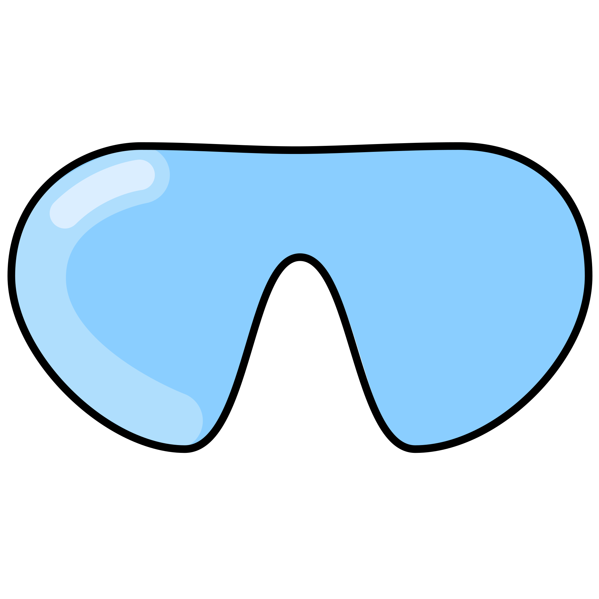

<p align="center">
    
</p>

<p align="center">
    <a href="#badge">
        
    </a>
    <a href="#badge">
        
    </a>
    <a href="#badge">
        
    </a>
    <a href="#badge">
        
    </a>
</p>

## Table of Contents

- [Table of Contents](#table-of-contents)
- [About](#about)
- [Installation](#installation)
- [Getting Started](#getting-started)
  - [Basic Setup](#basic-setup)
  - [Quick View](#quick-view)
- [Plugins](#plugins)
- [Documentation](#documentation)

## About

DIVE is a spatial framework made by and optimized for Shopwell. It can be used directly integrated
in a Shopwell frontend such as Storefront or in any other frontend you want to use it in, it is not
tied to Shopwell.

DIVE supplies your frontend application with all needed tooling to set up a basic 3D application
with event-based controls called "Actions".

## Installation

The `@shopwell-ag/dive` package can be installed via

```bash
npm install @shopwell-ag/dive

or

yarn add @shopwell-ag/dive
```

For local development setup, see [Local Development Guide](./docs/local-development.md).

## Getting Started

### Basic Setup

To get started with DIVE, import and instantiate it:

```ts
import { DIVE } from '@shopwell-ag/dive';

// Create a DIVE instance
const dive = new DIVE();
const myCanvasWrapper = document.createElement('div');
myCanvasWrapper.appendChild(dive.canvas);
```

### Quick View

For a simpler setup, you can use QuickView to quickly display your assets within a basic default
scene setup:

```ts
import { DIVE } from '@shopwell-ag/dive';

// Use static QuickView method to instantiate DIVE
const dive = await DIVE.QuickView('your/asset/uri.glb');
const myCanvasWrapper = document.createElement('div');
myCanvasWrapper.appendChild(dive.canvas);
```

## Plugins

DIVE comes with several built-in plugins that provide specific functionality. They are self-contained and can be imported as a subpath export from the package:

```ts
import { ARSystem } from '@shopwell-ag/dive/ar';

// Initialize AR with options
const arSystem = new ARSystem();
await arSystem.launch('path/to/model.glb', {
    arPlacement: 'horizontal', // or 'vertical'
    arScale: 'auto' // or 'fixed'
});
```

For detailed information about the plugin system, see
[Plugin System Documentation](docs/plugin-system.md).

## Documentation

For detailed documentation, please refer to the following sections:

- [Plugin System](docs/plugin-system.md) - Detailed plugin system architecture and usage
- [Shopwell Integration](docs/shopwell-integration.md) - Integration with Shopwell projects
- [Testing and Quality Assurance](docs/testing.md) - Testing guidelines and best practices
- [Local Development](docs/local-development.md) - Local development setup and workflow
